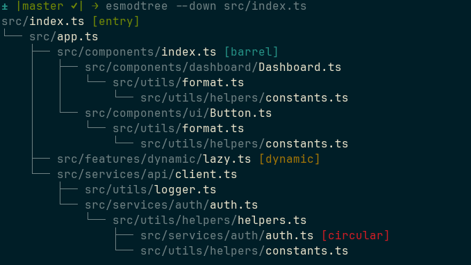
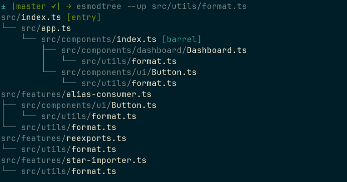
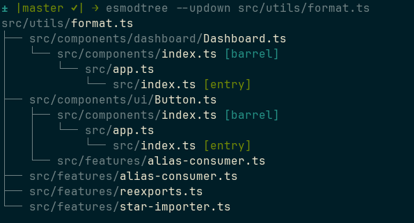
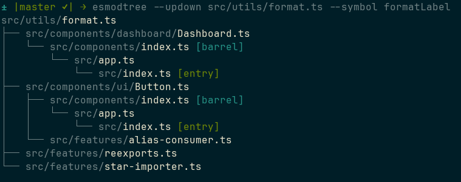

# esmodtree

ES Module import tree visualizer.

## Overview

Produces `tree`-style ASCII dependency trees for TypeScript/JavaScript projects. Answers two questions fast:

- **Where is this module used?** — walk importers upward, all the way to entry points.
- **What does this entry point depend on?** — walk dependencies downward.









## Packages

| Package          | Path                      | Description                                                                                     |
| ---------------- | ------------------------- | ----------------------------------------------------------------------------------------------- |
| `@esmodtree/cli` | `packages/cli`            | CLI tool (`esmodtree` bin) that visualizes ES module import trees. Built on dependency-cruiser. |
| `nvim-esmodtree` | `packages/nvim-esmodtree` | Neovim plugin (pure Lua, Neovim >= 0.10) wrapping the CLI.                                      |

See the per-package READMEs for usage details:

- [`packages/cli/README.md`](packages/cli/README.md)
- [`packages/nvim-esmodtree/README.md`](packages/nvim-esmodtree/README.md)

## Requirements

- Node >=22 and pnpm 10.33 (pinned via `mise`; see `.mise.toml`)
- Neovim >= 0.10 (plugin only)

## Getting started

```sh
pnpm install
pnpm check    # format:check + typecheck (also pre-commit hook)
pnpm test     # run tests across all packages
```

## License

GPLv3.0. See [LICENSE](./LICENSE).
